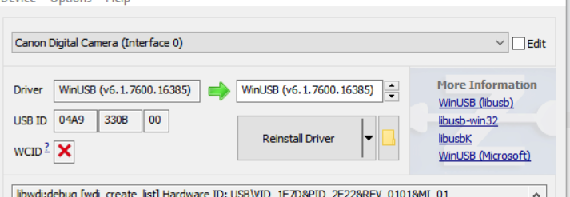

# pyDSLR - Python Camera Control Made Easy

This library aims at providing an easy to use and fully typed interface to cameras supported by libgphoto2, allowing you to 
capture images and video streams much easier than with native bindings.

The main idea is to have you specify your camera config base class whenever working with the camera, allowing auto-completion of available options as follows:

```python
from pathlib import Path
from pydslr.tools.camera import Camera
from pydslr.config.r6m2 import R6M2Config, ImageSettings, Settings, CaptureSettings

with Camera[R6M2Config]() as c:
    with c.config_context(
        R6M2Config(
            imgsettings=ImageSettings(iso="400"),
            settings=Settings(capturetarget="Internal RAM"),
            capturesettings=CaptureSettings(aperture="5.6", shutterspeed="2"),
        )
    ):
        c.preview_to_file(Path('preview.jpg'))
```

## Installation

### MacOS (via Homebrew)

```bash
brew install pkg-config libgphoto2 exiftool
pip install git+https://github.com/Zahlii/pyDSLR.git@main
```

### Linux / Ubuntu
```bash
apt-get install libgphoto2-6 exiftool
pip install git+https://github.com/Zahlii/pyDSLR.git@main
```

### Windows

- Install [Zadig](https://zadig.akeo.ie/) 
- Install [MYSYS2](https://www.msys2.org/) 
- Install libgphoto2 for MINGW64: `pacman -S mingw-w64-x86_64-gphoto2`
- Install pkg-config for MINGW64: `pacman -S mingw-w64-x86_64-pkg-config`
- Install Python for MINGW64: `pacman -S mingw-w64-x86_64-python`
- Install msgpack for MINGW64: `pacman -S mingw-w64-x86_64-python-msgpack`
- Install rust (needed for some dependencies) for MINGW64: `pacman -S mingw-w64-x86_64-rust`
- Install psutil for MINGW64: `pacman -S mingw-w64-x86_64-python-psutil`
- Install Pillow for MINGW64: `pacman -S mingw-w64-x86_64-python-pillow`
- Install ninja (needed for some dependencies) for MINGW64: `pacman -S mingw-w64-x86_64-ninja`
- Install numpy for MINGW64: `pacman -S mingw-w64-x86_64-python-numpy`
- Install Pydantic for MINGW64: `pacman -S mingw-w64-x86_64-python-pydantic`
- Install using `SETUPTOOLS_USE_DISTUTILS=stdlib pip install -r requirements.txt`
- Plug in your camera, start Zadig, make sure the "Interface 0" of your camera is set to WinUSB (see picture below)



## Adding new camera config types

- Connect your Camera via USB
- Run `python script/create_config.py a7iv --class_name=A7IV` to generate a new file inside app/config named a7iv.py containing the type definitions, with a base class called `A7IVConfig`.
- Open the result file, and rename the classes suffixed with `P_` to something reasonable
- Open a pull request

## Contributing / Running all checks & tools

```bash
poetry run isort .
poetry run black .
poetry run pylint **/*.py
poetry run mypy . --explicit-package-bases
```

## Photo Booth Helpers & REST Service

In `main.py` you also find a basic REST interface that allows you to build basic photo booth applications, also providing a fallback option to use OpenCV + Webcams instead of a gphoto2 compatible attached camera for easier testing. It includes printing helpers, a live stream feature, and an interface to capture and save snapshots.